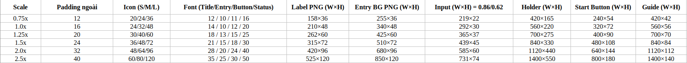

# LeetCode279: Perfect Squares

*(Đảm bảo rằng file ảnh nằm đúng vị trí: `src/assets/resources/gui204_count_primes/LeetCode204-design-tkapp.png`)*

# LeetCode204: CountPrimes

*(Đảm bảo rằng file ảnh nằm đúng vị trí: `src/assets/resources/gui204_count_primes/LeetCode204-design-tkapp.png`)*


## Dimension constraints design

*(Đảm bảo rằng file ảnh nằm đúng vị trí: `src/assets/images/dimension_constraints.png`)*

# win-py310 Libs Information
# 📦 Library Inventory (Python 3.10)

> Tổng hợp từ danh sách thư mục cung cấp (site-packages). Có phân nhóm.
---

## 🟩 GUI / Desktop

| Package          |    Version | Ghi chú                                            |
| ---------------- | ---------: | -------------------------------------------------- |
| **tkinter**      | *(stdlib)* | Có sẵn theo Python (không nằm trong site-packages) |
| **tkinterdnd2**  |      0.4.3 | Drag & Drop cho Tkinter                            |
| **pyglet**       |     2.1.12 | Multimedia / windowing                             |
| **Pillow (PIL)** |     12.1.0 | Xử lý ảnh (thư mục `PIL`)                          |

---

## 🟦 Data / Excel / Scientific

| Package        | Version |
| -------------- | ------: |
| **numpy**      |   2.2.6 |
| **pandas**     |   2.3.3 |
| **openpyxl**   |   3.1.5 |
| **et_xmlfile** |   2.0.0 |

---

## 🟨 Networking / HTTP

| Package                |    Version |
| ---------------------- | ---------: |
| **requests**           |     2.32.5 |
| **urllib3**            |      2.6.2 |
| **certifi**            | 2025.11.12 |
| **charset-normalizer** |      3.4.4 |
| **idna**               |       3.11 |

---

## 🟧 Time / Date

| Package             |     Version |
| ------------------- | ----------: |
| **python-dateutil** | 2.9.0.post0 |
| **pytz**            |      2025.2 |
| **tzdata**          |      2025.3 |
| **six**             |      1.17.0 |

---

## 🟥 Serial / Windows helpers

| Package            |    Version | Ghi chú                |
| ------------------ | ---------: | ---------------------- |
| **pyserial**       |        3.5 | (thư mục `serial`)     |
| **pywin32-ctypes** |      0.2.3 | Windows ctypes helpers |
| **win32ctypes**    | *(module)* | thư mục `win32ctypes`  |

---

## 🟪 Build / Packaging / PyInstaller

| Package                       |   Version |
| ----------------------------- | --------: |
| **PyInstaller**               |    6.17.0 |
| **pyinstaller-hooks-contrib** |   2025.11 |
| **altgraph**                  |    0.17.5 |
| **pefile**                    | 2024.8.26 |
| **packaging**                 |      25.0 |
| **pip**                       |      25.3 |
| **setuptools**                |    80.9.0 |
| **wheel**                     |    0.45.1 |

---

## ⬜ Misc / internal / file xuất hiện trong thư mục

> Các mục này thường là thành phần nội bộ / file `.py` đi kèm (không nhất thiết là “package” độc lập).

* `_distutils_hack`
* `pkg_resources`
* `distutils-precedence.pth`
* `__pycache__`
* `pefile.py`
* `peutils.py`
* `ordlookup`
* `numpy.libs`
* `pandas.libs`

---

## ✅ Raw list

```text
altgraph
altgraph-0.17.5.dist-info
certifi
certifi-2025.11.12.dist-info
charset_normalizer
charset_normalizer-3.4.4.dist-info
dateutil
python_dateutil-2.9.0.post0.dist-info
_distutils_hack
distutils-precedence.pth
et_xmlfile
et_xmlfile-2.0.0.dist-info
idna
idna-3.11.dist-info
numpy
numpy-2.2.6.dist-info
numpy-2.2.6-cp310-cp310-win_amd64.whl
numpy.libs
openpyxl
openpyxl-3.1.5.dist-info
ordlookup
packaging
packaging-25.0.dist-info
pandas
pandas-2.3.3.dist-info
pandas.libs
PIL
pillow-12.1.0.dist-info
pip
pip-25.3.dist-info
pkg_resources
pyglet
pyglet-2.1.12.dist-info
PyInstaller
pyinstaller-6.17.0.dist-info
pyinstaller_hooks_contrib-2025.11.dist-info
_pyinstaller_hooks_contrib
pefile.py
pefile-2024.8.26.dist-info
peutils.py
pyserial-3.5.dist-info
serial
pywin32_ctypes-0.2.3.dist-info
requests
requests-2.32.5.dist-info
setuptools
setuptools-80.9.0.dist-info
six.py
six-1.17.0.dist-info
tkinterdnd2
tkinterdnd2-0.4.3.dist-info
tzdata
tzdata-2025.3.dist-info
urllib3
urllib3-2.6.2.dist-info
wheel
wheel-0.45.1.dist-info
win32ctypes
```
